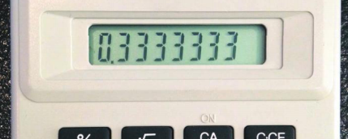
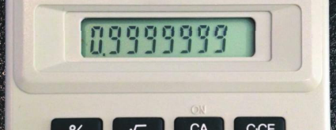

“**数学的目的是消除思考。**”菲利普·萨夫曼（Philip G. Saffman，1931年-2008年）

1978年，萨夫曼教授在一次课堂演讲中说这句话的时候，全场大笑。这堂课是加州理工学院许多专业都要求主修的应用数学本科三年级课程，大家普遍认为是很难的一门课程。所以当时的数学肯定在“消灭思考”方面失败了。

但是Saffman的观察是明智而深刻的。数学家建立的详尽的抽象结构使人们不必“思考”他们要解决的问题。一旦完成数学工作，只需遵循规则即可解决问题。随着自动计算的出现，我们甚至不必遵循规则。我们可以让计算机做到这一点。假设计算机算术遵循数学规则，因此可以安全地在坚固的基础之上构建庞大的结构。

但是，在计算机上执行即便是简单算术的规则并**不是**真正数学上的，因此，我们仍然必须思考。拿起任何袖珍计算器，将1除以3​​，您将看到类似以下内容：



当然，这与1/3不同。 我们认识到重复的小数，并且也许希望计算器知道正确的答案，但根本无法显示一连串永远持续下去的3。 但是，将其结果乘以3，通常
很明显，计算器返回了错误的答案：



一些计算器返回的值看起来是1.0000000，但是如果您从中减去1结果，弹出窗口会显示$-1*10^{-10}$或$-1*10^{-23}$。 喔噢！

人们有时会说：“计算机不会说谎。” 实际上，他们一直在撒谎，并以令人难以置信的高速在撒谎。 在撰写本文时，世界上最快的计算机
系统自豪地每秒产生3千万万亿个（30 quintillion）谎言，就像上面的谎言一样：

***计算机无法存储正确答案，因此它们用其他接近的答案替代了．***

但是这足够接近正确答案了吗？ 因为你必须仔细考虑一下，所以现有的计算机数学其实是无法“消除思考”。

为什么我们学会了忍受根本上像计算机一样逻辑的设备中的这种不严格的行为？ 合理化是这样形成的的：

“计算机具有有限的存储空间，但是实数的数量是无限的，因此有时候您必须妥协一点。 如果我们使用高精度，那可能就足够了。 我们是这么**希望**的。”

短语“**正确舍入**”(“correctly rounded”) 是一个矛盾词，因为舍入后的数字根据定义就是用*不正确的数字*去替换*正确的数字*。 **Macsyma**，**Mathematica**®和**Maple**等符号数学程序提供了很好的解决方案，但有很高的计算成本。如果您有时间，上帝就是整数。***区间算术***（Interval arithmetic）是一个诱人的方案，有望用严格的上下界范围进行计算，而不是用四舍五入的答案。但是当人们试图用它来解决物理学中的基本问题，虽然不会产生舍入误差，但是答案的界限比真实的结果宽松得多，并且过于宽松而没有意义了。为什么要采用一个花两倍的存储空间和两倍以上的算术工作的技术，而且答案需要比分析四舍五入的误差要更多专业知识来解释呢？

当美国同意在1990年代结束核试验时，开发和维护核武器的实验室认为它们可以用使用一项雄心勃勃的联邦计划－计算机模拟试验来替代：加速战略计算倡议（ASCI）。但是使用四舍五入的算术只是猜测和指导，而不能证明任何事情。已故诺贝尔奖获得者肯尼斯·威尔逊（Kenneth Wilson）是第一次宣布了计算方法是科学的第三分支，是对实验和理论方法的补充。


ASCI计划试图在缺乏实验基础上取得坚实的科学结论，但是由于浮点计算缺乏数学上的严格性，关于核武器的仿真结果仍然是猜测。

虽然少数人关注可证明的有效答案，但很多人的人在乎计算机消耗多少电量以及多少内存来解决问题。电脑公司的高管曾说：没有人抱怨四舍五入的错误”，但是现在每个人都强烈地意识到了获得更好的*每瓦的计算性能*和*每美元的计算性能*需求。假设我们有一种严格的计算机算法形式，可以保证答案正确且可以让程序员自由使用更少的位来存储数字呢？到2000年代初，计算机内存速度和能耗越来越限制了它们的性能。技术应用的用户和程序员坚持将64位精度作为避免四舍五入错误的方法，但也许有一种方法可以使有界结果更准确，使用位数更少，且可证明。如果这还可以倚赖更少的数值专业知识，而不是更多来完成，那么程序员的生产率就可以同时提高。

公式，数字和计算机代码都使一本书难以阅读。 最密集的代码被归类到附录中以缓解这一问题，通常读者无需阅读代码部分即可了解后续内容。 这本书是
用Mathematica编写的．这可以确保数学和图形是正确无误的。 在一个示例中，四位“ unum”值获得正确答案，而用四精度（128位）浮点运算失败； 显示代码的主要原因是因为一些怀疑论者否则会认为这样的计算是不可能的，并会怀疑是一种障眼法。 这里给出了工作所需的完整严格的计算环境。

这里提出的新想法均未获得或是在申请专利，这是作者的本意。

*unum方法提出的目的就是为了消除思考*


# 附注


```
3  thousand		　　　千
6  million		　　百万
9  billion　　　 　　十亿
12 trillion　　  　　万亿
15 quadrillion　　　千万亿
18 quintillion　　百万万亿
21 sextillion
24 septillion
27 octillion
30 nonillion
33 decillion
36 undecillion
39 duodecillion
42 tredecillion
45 quattuordecillion
48 quindecillion
51 sexdecillion
54 septendecillion
57 octodecillion
60 novemdecillion
63 vigintillion
66 - 120 undecillion - vigintillion
303 centillion
```

